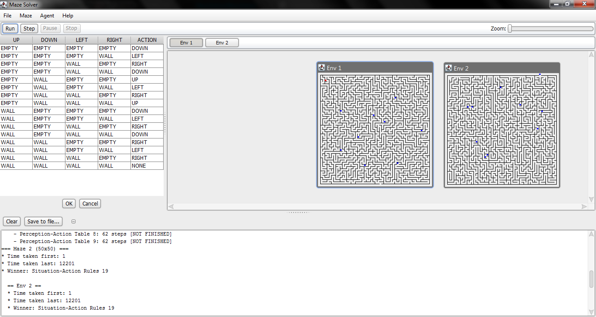

MazeSolver
==========

Programa generador y solucionador de laberintos utilizando técnicas de IA basadas en el paradigma de agentes.

## Links de interes
A continuación les listamos algunos links de interes tales como el blog [1] de la aplicación la wiki [2] alojada en github y la documentación del código [3].

En el blog puedes encontrar publicaciones divertidas y un resumen del avance de este proyecto.

En la wiki te puedes encontrar una descripción mas detallada de lo que es MazeSolver, Un tutorial para desarrolladores para añadir nuevos agentes al sistema, listado de versiones con lo que fue añadido en cada una, y mas.

La documentación del código es fue generada con JavaDoc y te permitira ver sin entrar al propio código de manera sencilla que se hace en cada paquete, metodo, clase.

* [[1](http://mazesolver.github.io/MazeSolver/)]
* [[2](https://github.com/MazeSolver/MazeSolver/wiki)]
* [[3](https://mazesolver.wordpress.com/)]

## [LICENSE](http://www.gnu.org/licenses/gpl-3.0.html) 

MazeSolver by its [contributors](https://github.com/kevinrobayna/MazeSolver/graphs/contributors) is free software: you can redistribute it and/or modify it under the terms of the GNU General Public License as published by the Free Software Foundation, either version 3 of the License, or (at your option) any later version.
