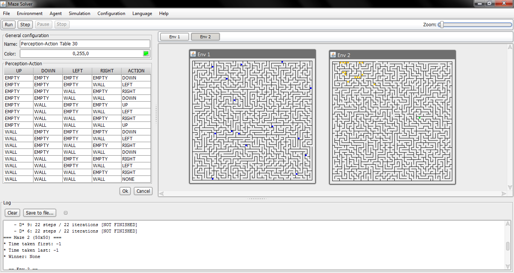

MazeSolver
==========

Programa generador y solucionador de laberintos utilizando técnicas de IA basadas en el paradigma de agentes.

## Links de interés

A continuación les listamos algunos links de interés relacionados con este proyecto.

* [Documentación de la API](http://mazesolver.github.io/MazeSolver/): La documentación del código fue generada con
  JavaDoc y te permitirá ver sin entrar al propio código de manera sencilla qué se hace en cada paquete, método o clase
  o para qué son ciertas constantes.
* [Wiki del proyecto](https://github.com/MazeSolver/MazeSolver/wiki): En la wiki te puedes encontrar una descripción mas
  detallada de lo que es MazeSolver, un tutorial para desarrolladores para añadir nuevos agentes al sistema, listado de
  versiones con lo que fue añadido en cada una, y más.
* [Blog del proyecto](https://mazesolver.wordpress.com/): En el blog puedes encontrar publicaciones divertidas y un
  resumen del avance de este proyecto.

## [LICENSE](http://www.gnu.org/licenses/gpl-3.0.html) 

MazeSolver by its [contributors](https://github.com/kevinrobayna/MazeSolver/graphs/contributors) is free software: you
can redistribute it and/or modify it under the terms of the GNU General Public License as published by the Free Software
Foundation, either version 3 of the License, or (at your option) any later version.
